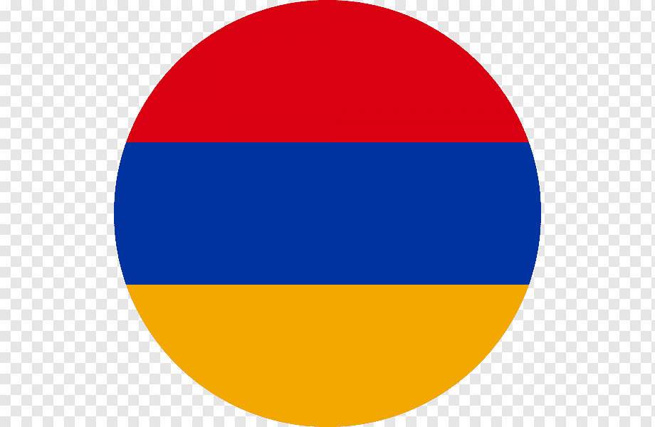
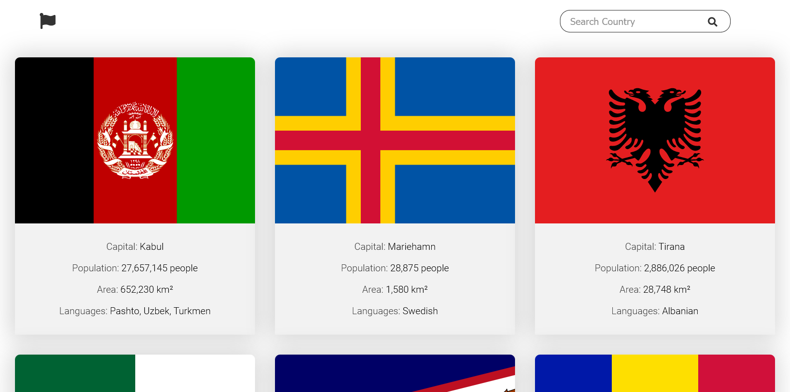
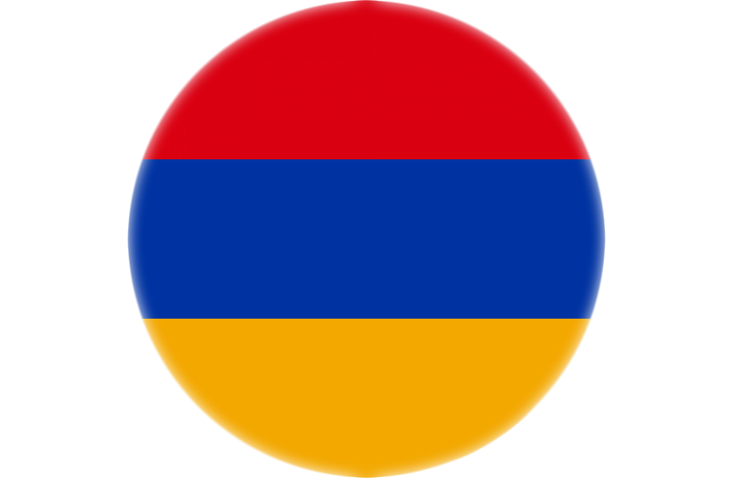

 

  
  

  Flags project
 <h3 align="center">The best website of the flags of the countries</h3>

## Screenshots from project

### About this project

This project is the best environment where you can find the most important information about the countries of the world. I hope you will like it very much. Welcome flags world!

<!-- LICENSE -->

## License

Distributed under the MIT License.
